# Virtual File Sytem

##### 一个使用大文件模拟磁盘的虚拟文件系统

###### Github：https://github.com/mookixiao/virtual_file_system

## 一、主体设计

**以下按照从低到高的地址顺序**

1. 超级块：存放文件系统主要信息

2. 文件系统描述区：存放文件系统其他信息

3. i节点位图区：记录各i节点使用情况，0表示空闲，1表示被占用

4. 数据块位图区：记录各数据块使用情况，0表示空闲，1表示被占用

5. i节点区：保存所有i节点数据结构

6. 数据块区：保存所有数据，包括普通数据、各目录目录项

## 二、预设参数

```c
#define BLKNUM 1024       // 数据块数量
#define BLKSIZE 1024      // 数据块大小
#define INDNUM 128        // i节点数量
```

## 三、主要数据结构

1. 超级块

   ```c
   typedef struct {  // 16字节
       // 数据块
       uint32_t blkNum;
       uint32_t blkNumFree;
       uint16_t blkSize;
       
       // i节点
       uint16_t indNum;
       uint16_t indNumFree;
       uint16_t indSize;
   } SuperBlk;
   ```
   
2. 文件系统描述

   ```c
   typedef struct {  // 64字节
       char label[48];
       // i节点区
       uint32_t indBeg;
       uint32_t indEnd;
   
       // 数据块区
       uint32_t blkBeg;
       uint32_t blkEnd;
   } FSInfo;
   ```

3. i节点位图

   ```c
   uint32_t indBitmap[INDNUM / 32];  // 16字节
   ```

4. 数据块位图

   ```c
   uint32_t blkBitmap[BLKNUM / 32];  // 128字节
   ```

5. i节点

   ```c
   #define IDXBLKNUMININODE 14
   typedef struct {  // 64字节
       uint32_t size;
       uint32_t type;
       uint32_t blkIdx[IDXBLKNUMININODE];  // 数据块直接索引
   } Inode;
   ```

6. 目录项

   ```c
   typedef struct {  // 32字节
       char name[28];
       uint32_t inodeIdx;
   } DirItem;
   ```

**计算本模拟文件系统大小：**$16+64+16+128+64\times128+1024\times1024=1056992\text{Bytes}$

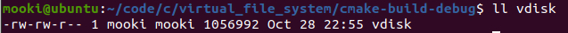

## 四、主要功能

1. 格式化文件系统：包括初始化模拟磁盘文件、创建根目录两步，即`moo_mkfs`可执行程序

   1）初始化：创建文件 --> 写入超级块 --> 写入文件系统描述 --> 写入i节点位图 --> 写入数据块位图 --> 写入数据块

   2）创建根目录：修改超级块 --> 修改i节点位图 --> 修改数据块位图 --> 写入根目录i节点 --> 写入根目录两个目录项

   （1）根目录i节点索引号为0

   （2）两个目录项包括"."、".."，它们对应的i节点索引号均为0

2. 查看文件系统信息：通过读取超级块、文件系统描述区两部分信息，即`moo_fsinfo`可执行程序

   打开模拟磁盘文件 --> 读取超级块 --> 格式化输出超级块信息 --> 读取文件系统描述 --> 格式化输出文件系统描述区信息

3. 显示当前路径各目录项：即`moo_exp`可执行程序中的`ls`命令

4. 改变当前路径：即`moo_exp`可执行程序中的`cd <dir>`命令

5. 创建文件：即`moo_exp`可执行程序中的`touch <file>`命令

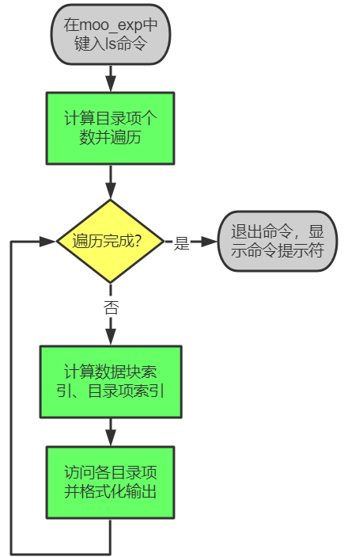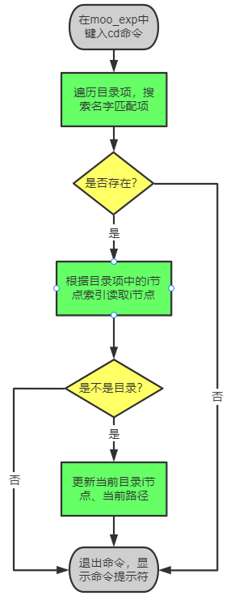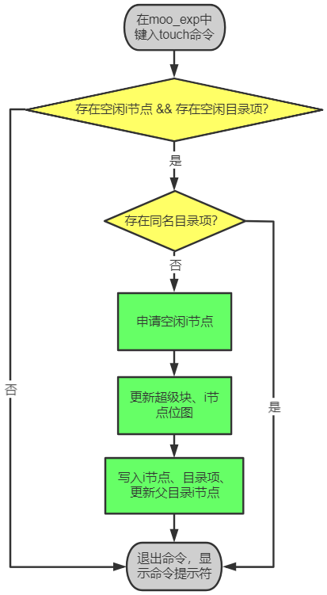

6. 删除文件：即`moo_exp`可执行程序中的`rm <file>`命令

7. 创建目录：即`moo_exp`可执行程序中的`mkdir <dir>`命令

8. 删除目录：即`moo_exp`可执行程序中的`rmdir <dir>`命令

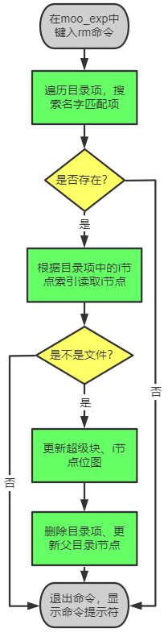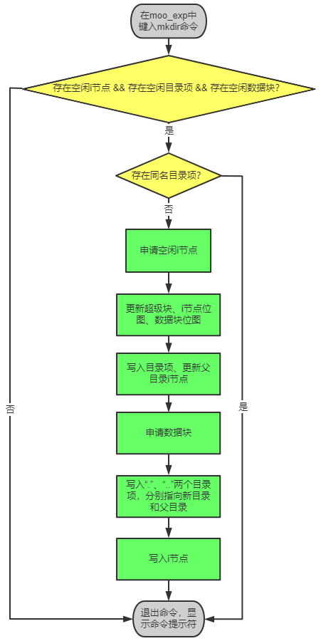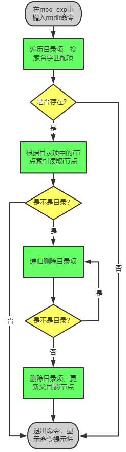

## 五、部分模块设计

1. 文件浏览器：实现了一个类似于shell的文件浏览器，在其中输入命令即可实现`ls`、`cd`、`touch`、`rm`、`mkdir`、`rmdir`等操作，伪代码如下：

   ```c
   // 1.cmd指针数组
   char* cmdArr[] = {"mkfs", "ls", "cd", "touch", "rm", "mkdir", "rmdir", "quit"};
   
   // 2.读取命令循环
   while(1)
       显示命令提示符;
       输入命令cmd;
   
       获取命令索引号cmdIdx;
   
       switch cmdIdx:
           case 0:  // mkfs
           case 1:  // ls
           case 2:  // cd
           case 3:  // touch
           case 4:  // rm
           case 5:  // mkdir
           case 6:  // rmdir
           case 7:  // quit
           default:  // 提示位置命令
   ```

2. 递归删除目录，伪代码如下：

   ```c
   int rmItemRecur(Inode* dirInode, uint16_t dirInodeIdx, DirItem* dirItem)  // 父目录i节点，父目录i节点索引，要删除的目录项
       读取要删除的目录项i节点，即itemInode;
   	if 目录项是一个文件
           释放对应的blk;
   		释放对应的inode;
   	else
           for 此目录中的各项
               读取目录项，即tmpDirItem;
   			if 目录项名为"."或".."
                   continue;
   			rmItemRecur(&itemInode, dirItem->inodeIdx, &tmpDirItem);  // 进入更深一层递归
   		释放对应的blk;
   		释放对应的inode;
   		删除父目录中的目录项dirItem;
   ```

## 六、构建说明

1. 本工程使用CMake构建，典型流程如下

   ```shell
   git clone https://github.com/mookixiao/virtual_file_system.git
   
   cd virtual_file_system
   
   mkdir build
   
   cd build
   
   cmake ..
   
   cmake --build .
   ```

2. 最终应得到`moo_mkfs`、`moo_fsinfo`、`moo_exp`三个可执行文件

## 七、使用流程及效果截图

1. 使用`./moo_mkfs`命令创建文件系统

   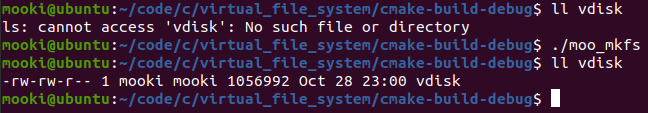

2. 使用`./moo_fsinfo`命令查看文件系统信息

   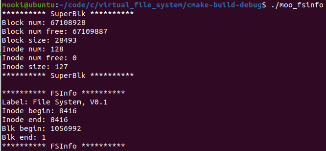

3. 使用`./moo_exp`命令进入文件系统浏览器

   1）ls

   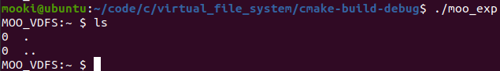

   2）touch

   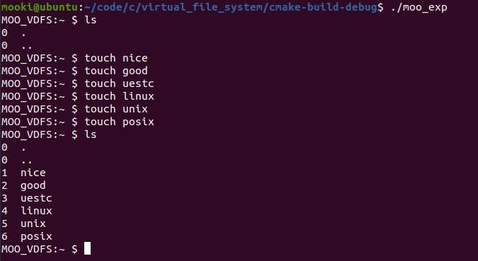

   3）rm

   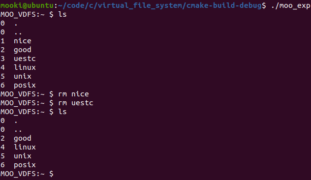

   4）cd和mkdir运行截图

   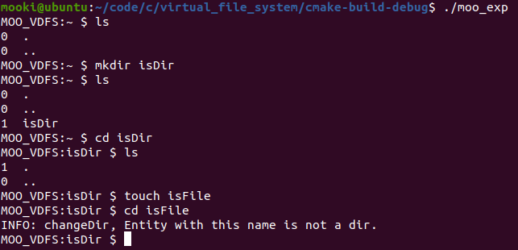

   5）rmdir运行截图
   
   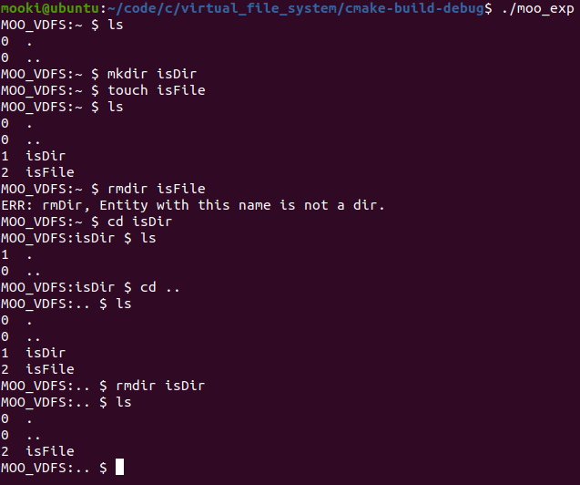

## 八、参考资料

1、《UNIX环境高级编程》

2、《C和指针》

3、《鸟哥的Linux私房菜 基础学习篇》

4、《操作系统概念》

5、《Unix\Linux编程实践教程》